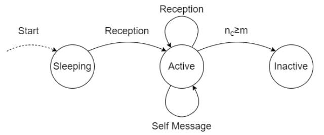
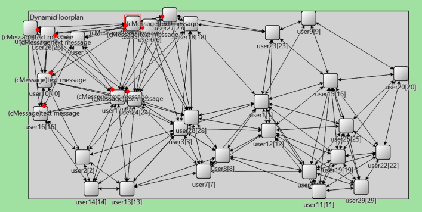

# Epidemic Broadcast - OMNeT++ Project

University project for "Performance Evaluation of Computer Systems and Networks" course (MSc Computer Engineering @ University of Pisa).

## Overview

The aim of the project is to measure and evaluate the broadcast time for a message in a 2D floorplan with N users, the percentage of covered users and the number of collisions. The network has been simulated with `OMNeT++`.

The evaluation is made with the following parameters:
* Radius R
* Number of slot T
* Number of copies m
* Number of users N

Performance Indeces:
* Broadcast Time
* Number of Collisions
* Percentage of Covered Users

Assumptions:
* Communications are slotted
* Message transmission last one slot
* No transmission delay
* Collided messages will be dropped
* Trickle Relaying policy
* Time Windows misaligned for a factor of τ
* Users’ positions and τ are uniformly distributed

## Implementation

In the implementation the only existing entity is the user.

### User Module

The user module has bidirectional links with its neighbors and a couple of coordinates
that represents its position in the floorplan.
Every user has a own finite memory used to store only the messages received in the
last time window and their arrival time. It is also used to keep information about the
collisions. During the user initialization, the factor τ is generated randomly between
[1, T − 1].

### User Behavior
The user behavior depends on its current state. Three different state are defined:
* **Sleeping**: it’s the state before the first successfully received message and it’s the
default starting state for all users except the source user.
* **Active**: it’s the normal operating state for all users. It consists of a check of the
message’s copies repeated every time window, that allows to decide if the user has
to relay the message or deactivates itself.
* **Inactive**: it’s the ending state in which the user doesn’t relay any message and
ignores all the receptions.

  

### Dynamic Network

In order to make a completely study of this scenario, it is useful to generate dynamically
a network. Two systems have been implemented:
* Dynamic Radius: given a specific network consisting of users with a fixed position,
the system dynamically generates the links between them, according to the value of
the radius.
* Dynamic Positions: given the number of the users, the system creates them and
assigns positions in line with an uniform distribution. Then it creates the links
exploiting the Dynamic Radius generation.

The first type of generation is used to test a specific positioning of the users with different
radius. The second one is useful to evaluate as many combinations as possible between
the number of users and all other possible parameters

  

For model verification and analysis go to the documentation.

WARNING: The 2kr analysis is not reliable because the procedure used is not the standard one. 

## Authors

* Biagio Cornacchia, b.cornacchia@studenti.unipi.it
* Gianluca Gemini, gianlucagemini98@gmail.com
* Matteo Abaterusso, m.abaterusso@studenti.unipi.it
